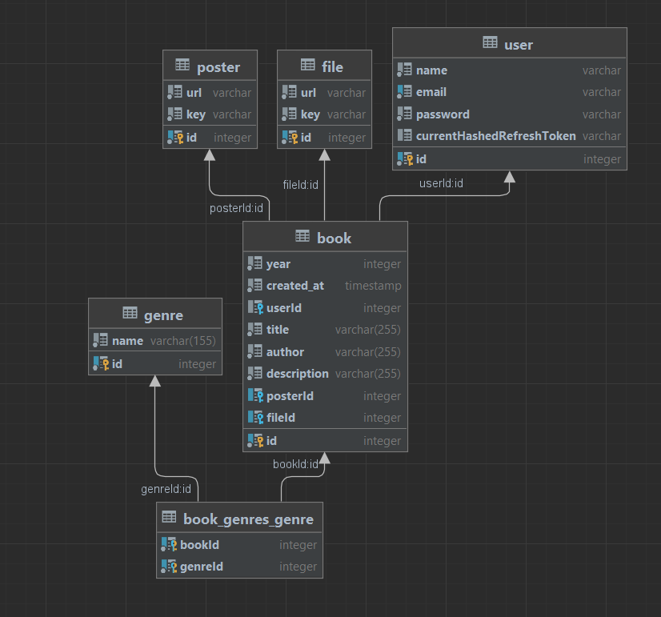

## Book sharing.

**You can upload the book:**
- add book file(file) 
- add book cover(file)
- title(string)
- author(string)
- year(number)
- genres(array)

**You can search book by:**
- title
- year
- author
- genres

**You can:**
- delete book
- get 1 book
- download file

**Next features:**
- rating
- comments


## DB Schema



**Stack:**
- NestJS;
- PostgeSQL;
- typescript;
- REST;
- AWS;
- JWT
- Passport
- TypeORM

## Running the app

```bash
# development
$ npm run start

# watch mode
$ npm run start:dev

# production mode
$ npm run start:prod

# start db
$ docker-compose up
```

## Test

```bash
# unit tests
$ npm run test

# e2e tests
$ npm run test:e2e

# test coverage
$ npm run test:cov
```
